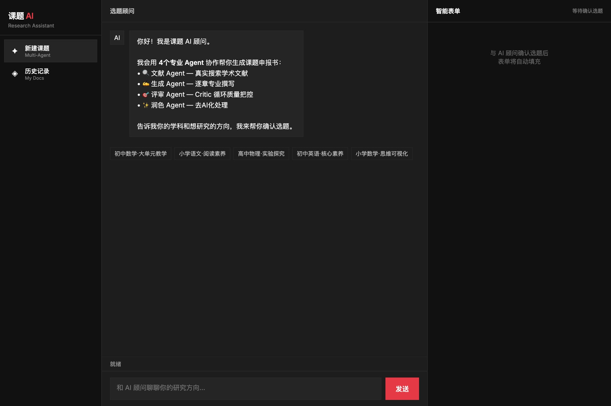
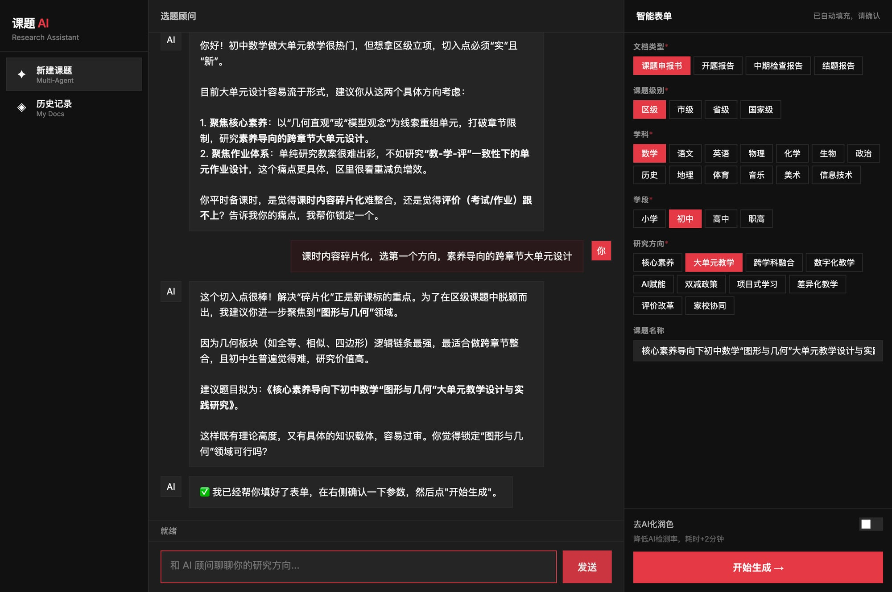
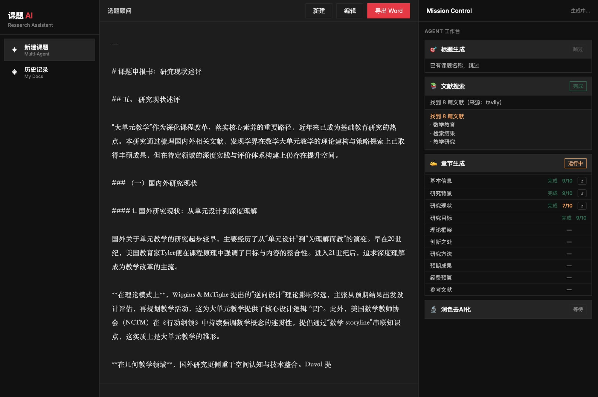
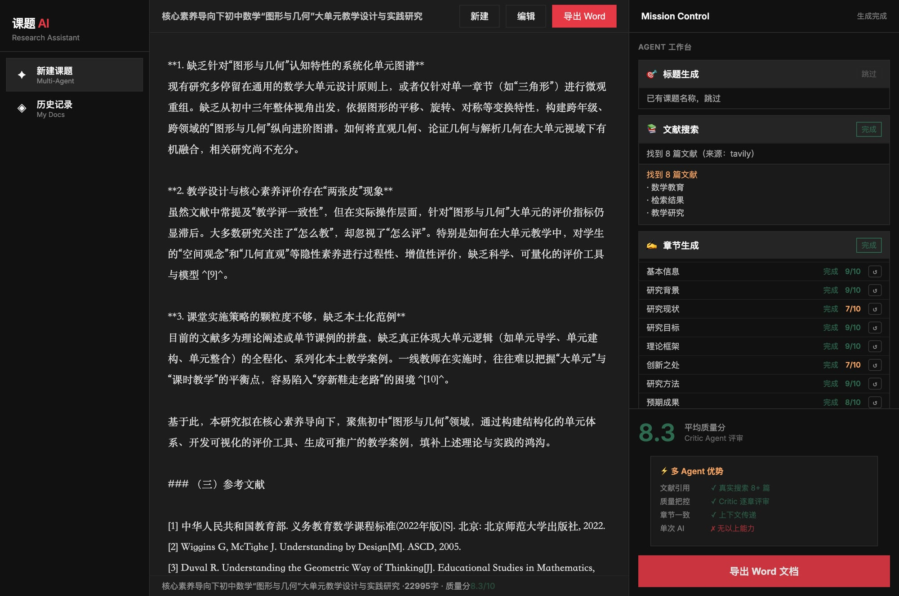

# 课题 AI — 教师课题申报书智能生成系统

> 用 4 个专业 Agent 协作，帮教师生成高质量课题申报书、开题报告、中期检查、结题报告。

## 功能特点

- **AI 选题顾问** — 对话式确认研究方向，自动填充表单
- **Multi-Agent 架构** — 文献 Agent + 生成 Agent + 评审 Agent + 润色 Agent 协作
- **真实文献搜索** — 接入 Tavily，搜索真实学术文献并引用
- **Critic 质量把控** — 每章生成后自动评审打分，低分重写
- **一键导出 Word** — 生成标准 .docx 格式，可直接提交

## 截图

### 首页 & 选题顾问



### AI 对话 + 表单自动填充

与 AI 顾问确认选题后，右侧表单自动填充课题级别、学科、研究方向、课题名称。



### Mission Control — 多 Agent 实时进度

点击"开始生成"后，进入 Mission Control 视图，实时显示各 Agent 工作状态和章节评分。



### 生成完成

22,995 字，平均质量分 8.3/10，10 个章节全部完成，支持一键导出 Word。



## 测试用例

**课题**：《核心素养导向下初中数学"图形与几何"大单元教学设计与实践研究》（区级）

| 章节 | 质量分 |
|------|--------|
| 基本信息 | 9/10 |
| 研究背景与意义 | 9/10 |
| 研究目标与内容 | 9/10 |
| 研究框架与理论基础 | 9/10 |
| 研究方法与实施计划 | 9/10 |
| 参考文献 | 9/10 |
| 预期研究成果 | 8/10 |
| 研究现状述评 | 7/10 |
| 研究重难点与创新 | 7/10 |
| 经费预算 | 7/10 |
| **平均** | **8.3/10** |

总字数：22,995 字 | 文献数：35 篇 | 生成时间：约 8 分钟

## 快速开始

```bash
# 安装依赖
npm install

# 配置环境变量
cp .env.example .env
# 填写 AI_API_KEY（支持 GLM / OpenAI / Claude）

# 启动服务
node server.mjs
# 访问 http://localhost:3001
```

## 技术栈

- **后端**：Node.js + Express (ESM)
- **数据库**：SQLite (better-sqlite3)
- **AI**：GLM-5 / 可切换 OpenAI 兼容接口
- **文献搜索**：Tavily API
- **Word 生成**：docx 库
- **前端**：原生 HTML/CSS/JS（无框架）

## Agent 架构

```
用户输入
  └─ 选题顾问 (Chat Agent)
       └─ 确认选题 → 触发生成流程
            ├─ 文献 Agent    → 搜索 8+ 篇真实文献
            ├─ 生成 Agent    → 逐章专业撰写
            ├─ 评审 Agent    → Critic 循环质量把控
            └─ 润色 Agent    → 去AI化处理
```

## 已知问题

- 润色去AI化流程偶发不触发（待修复）
- 生成内容未持久化到数据库，刷新后丢失（待修复）
- 左侧文档存在重复标题渲染（待修复）
